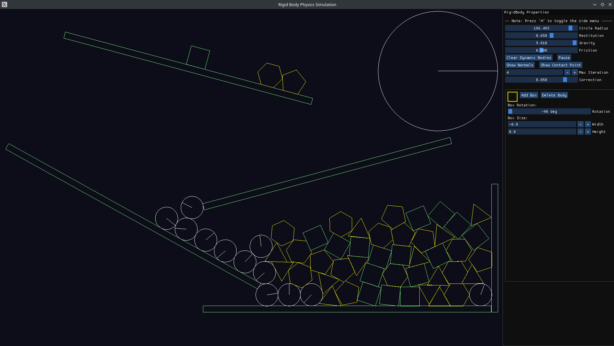

# 🧱 Rigid Body Simulation



A 2D physics engine built using Modern OpenGL and Dear ImGui, supporting real-time rendering and interactive GUI controls.

---

## 🚀 Setup and Run Instructions

# 🧩 Clone the Repository
```
git clone https://github.com/Bishmit/RigidBodySim-OpenGL.git
cd RigidBodySim-OpenGL
```

# 💻 Platform-Specific Build Instructions

🐧 **Linux (Debian/Ubuntu)**
<br>
```
sudo apt update
sudo apt install libglfw3-dev libgl1-mesa-dev libx11-dev libxi-dev libxrandr-dev \
                 libxinerama-dev libxcursor-dev libgl-dev ninja-build cmake g++

mkdir build && cd build
cmake .. -G Ninja
ninja
./main
```

🐧 **Linux (Arch)**
<br>
```
sudo pacman -Syu glfw-x11 mesa ninja cmake gcc

mkdir build && cd build
cmake .. -G Ninja
ninja
./main
```

🐧 **Linux (Fedora)**
<br>
```
sudo dnf install glfw-devel mesa-libGL-devel ninja-build cmake g++

mkdir build && cd build
cmake .. -G Ninja
ninja
./main
```

**MacOS**
<br>
```
brew install glfw glad cmake ninja

mkdir build && cd build
cmake .. -G Ninja
ninja
./main

**If CMake fails to detect OpenGL/GLFW on macOS**
<br>
export GLFW_DIR=$(brew --prefix glfw)
```

**Windows (Visual Studio)**
<br>
```
mkdir build && cd build
cmake .. -G "Visual Studio 17 2022"
```

**Open the generated solution in Visual Studio and build the project**

